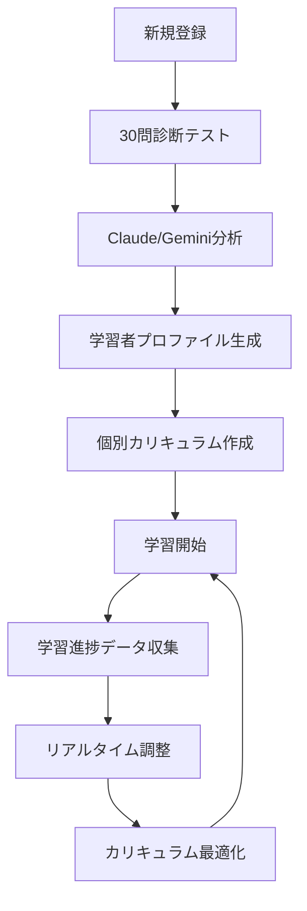

🎯 設計の核心的な特徴
1. 段階的AI導入戦略

Phase 1: AI機能なしで基本システム構築（即座開始可能）
Phase 2: Claude/Gemini API統合によるパーソナライゼーション
Phase 3: 高度な予測的学習支援

2. 30問診断→AI分析→個別カリキュラム

学習スタイル、スキルレベル、興味、性格特性を多角的に分析
Claude/Geminiの高度な言語理解でより精密なプロファイリング
個人に最適化されたカリキュラムを自動生成

3. マルチLLM対応アーキテクチャ

Claude、Gemini、ChatGPTを用途に応じて使い分け
APIコスト最適化とフォールバック機能
キャッシュシステムで効率化

🚀 競合優位性
従来の学習プラットフォームとの差別化:

静的コース → 動的パーソナライズ
一律カリキュラム → AI生成個別プラン
事後分析 → 予測的支援

実装の現実性:

既存プロジェクト構造を最大限活用
機能フラグによる段階的展開
開発リスクの最小化

📋 推奨する開発開始手順
今すぐ開始できること（Phase 1）

診断テストDB構築 (1週間)

30問の質問データベース作成
基本スコア計算ロジック実装


パーソナライゼーション基盤 (2週間)

ユーザープロファイルDB
テンプレートベースカリキュラム
基本推薦システム


UI実装 (1週間)

診断テストページ
パーソナライズダッシュボード
推薦表示コンポーネント


Phase 2での AI統合 (後日)

Claude/Gemini API統合
診断結果のAI分析
AI生成カリキュラム

この段階的アプローチにより：

即座にユニークな価値提供開始
技術リスク最小化
市場検証しながらAI機能追加

まずはPhase 1の基本システムから始めることをお勧めします。どの部分から実装を開始したいか、または特定の技術的な質問はありますか？RetryClaude can make mistakes. Please double-check responses.

# パーソナライズ学習システム 設計書

## 1. システム概要

### 1.1 パーソナライゼーションフロー


### 1.2 AI支援の段階的導入計画

#### Phase 1: 基本システム（AI機能なし）
- 静的な30問診断テスト
- 事前定義されたカリキュラムテンプレート
- 手動でのコース推薦

#### Phase 2: AI分析導入
- Claude/Gemini APIによる診断結果分析
- AI生成カリキュラム
- 基本的な学習アドバイス

#### Phase 3: 高度なパーソナライゼーション
- リアルタイム学習行動分析
- 動的カリキュラム調整
- 予測的学習支援

## 2. データベース設計（拡張）

### 2.1 パーソナライゼーション関連テーブル
```sql
-- 診断テスト
CREATE TABLE diagnostic_tests (
    id UUID PRIMARY KEY DEFAULT gen_random_uuid(),
    name VARCHAR(255) NOT NULL,
    description TEXT,
    questions JSONB NOT NULL, -- 30問の質問データ
    version INTEGER DEFAULT 1,
    is_active BOOLEAN DEFAULT true,
    created_at TIMESTAMP WITH TIME ZONE DEFAULT NOW()
);

-- 診断結果
CREATE TABLE user_diagnostics (
    id UUID PRIMARY KEY DEFAULT gen_random_uuid(),
    user_id UUID REFERENCES auth.users(id),
    test_id UUID REFERENCES diagnostic_tests(id),
    answers JSONB NOT NULL, -- 回答データ
    raw_scores JSONB, -- 各分野のスコア
    ai_analysis JSONB, -- AI分析結果（後から追加）
    completed_at TIMESTAMP WITH TIME ZONE DEFAULT NOW(),
    UNIQUE(user_id, test_id)
);

-- 学習者プロファイル
CREATE TABLE user_learning_profiles (
    id UUID PRIMARY KEY DEFAULT gen_random_uuid(),
    user_id UUID REFERENCES auth.users(id) UNIQUE,
    learning_style VARCHAR(50), -- visual, auditory, kinesthetic, mixed
    difficulty_preference VARCHAR(50), -- easy_start, challenge_driven, balanced
    pace_preference VARCHAR(50), -- slow, normal, fast
    interest_areas TEXT[], -- programming, design, music, etc.
    skill_levels JSONB, -- {"programming": 3, "design": 1, "music": 2}
    personality_traits JSONB, -- AI分析による性格特性
    motivation_factors TEXT[], -- achievement, creativity, social, etc.
    ai_insights JSONB, -- AI生成の詳細インサイト
    last_updated TIMESTAMP WITH TIME ZONE DEFAULT NOW()
);

-- 個別カリキュラム
CREATE TABLE personalized_curricula (
    id UUID PRIMARY KEY DEFAULT gen_random_uuid(),
    user_id UUID REFERENCES auth.users(id),
    profile_id UUID REFERENCES user_learning_profiles(id),
    curriculum_data JSONB NOT NULL, -- 個別カリキュラム構造
    generation_method VARCHAR(50) DEFAULT 'template', -- template, ai_generated
    ai_rationale TEXT, -- AI生成の場合の根拠
    estimated_duration_weeks INTEGER,
    difficulty_progression JSONB, -- 難易度の進行計画
    checkpoint_milestones JSONB, -- マイルストーン設定
    created_at TIMESTAMP WITH TIME ZONE DEFAULT NOW(),
    updated_at TIMESTAMP WITH TIME ZONE DEFAULT NOW()
);

-- 学習行動データ（AI分析用）
CREATE TABLE learning_analytics (
    id UUID PRIMARY KEY DEFAULT gen_random_uuid(),
    user_id UUID REFERENCES auth.users(id),
    session_id VARCHAR(255), -- 学習セッションID
    event_type VARCHAR(100), -- lesson_start, lesson_complete, pause, seek, etc.
    event_data JSONB, -- 詳細なイベントデータ
    timestamp TIMESTAMP WITH TIME ZONE DEFAULT NOW(),
    
    INDEX(user_id, timestamp)
);

-- AI生成コンテンツ（後から導入）
CREATE TABLE ai_generated_content (
    id UUID PRIMARY KEY DEFAULT gen_random_uuid(),
    user_id UUID REFERENCES auth.users(id),
    content_type VARCHAR(50), -- hint, explanation, exercise, quiz
    trigger_context JSONB, -- 生成トリガーとなったコンテキスト
    generated_content JSONB, -- AI生成コンテンツ
    ai_model VARCHAR(50), -- claude, gemini, gpt4, etc.
    confidence_score DECIMAL(3,2),
    user_feedback INTEGER, -- 1-5 rating
    created_at TIMESTAMP WITH TIME ZONE DEFAULT NOW()
);
```

### 2.2 30問診断テストの質問構造
```typescript
interface DiagnosticQuestion {
  id: string;
  category: 'learning_style' | 'skill_level' | 'interest' | 'personality' | 'motivation';
  question: string;
  type: 'multiple_choice' | 'scale' | 'ranking' | 'scenario';
  options?: string[];
  scale_range?: { min: number; max: number; labels: string[] };
  scenario?: {
    description: string;
    choices: { option: string; traits: string[] }[];
  };
}

// 質問例
const sampleQuestions: DiagnosticQuestion[] = [
  {
    id: "ls_001",
    category: "learning_style",
    question: "新しいソフトウェアを学ぶとき、どの方法が最も効果的ですか？",
    type: "multiple_choice",
    options: [
      "動画チュートリアルを見る",
      "文書やマニュアルを読む", 
      "実際に触って試す",
      "誰かに教えてもらう"
    ]
  },
  {
    id: "sk_001", 
    category: "skill_level",
    question: "プログラミング経験はどの程度ですか？",
    type: "scale",
    scale_range: {
      min: 1,
      max: 5,
      labels: ["全くなし", "少しある", "基本はできる", "結構できる", "上級者"]
    }
  },
  {
    id: "int_001",
    category: "interest",
    question: "以下の分野を興味順に並べてください",
    type: "ranking",
    options: [
      "Webアプリ開発",
      "ゲーム開発", 
      "AI/機械学習",
      "3DCG/アニメーション",
      "音楽制作"
    ]
  },
  {
    id: "per_001",
    category: "personality",
    question: "プロジェクトに取り組むとき",
    type: "scenario",
    scenario: {
      description: "大きなプロジェクトが与えられました。あなたの行動は？",
      choices: [
        { option: "まず全体を把握してから計画を立てる", traits: ["analytical", "planning"] },
        { option: "とりあえず始めてみる", traits: ["action_oriented", "experimental"] },
        { option: "類似事例を調べる", traits: ["research_driven", "cautious"] },
        { option: "チームメンバーと相談する", traits: ["collaborative", "social"] }
      ]
    }
  }
];
```

## 3. AI統合アーキテクチャ（後から導入）

### 3.1 マルチLLM対応システム
```typescript
// src/services/ai/LLMProvider.ts
export interface LLMProvider {
  name: string;
  analyze(prompt: string, context?: any): Promise<AIResponse>;
  generateCurriculum(profile: UserProfile, diagnostics: DiagnosticResult): Promise<Curriculum>;
  provideHint(question: string, context: LearningContext): Promise<string>;
}

export class ClaudeProvider implements LLMProvider {
  name = 'claude';
  
  async analyze(prompt: string, context?: any): Promise<AIResponse> {
    const response = await fetch('https://api.anthropic.com/v1/messages', {
      method: 'POST',
      headers: {
        'Content-Type': 'application/json',
        'Authorization': `Bearer ${process.env.CLAUDE_API_KEY}`,
        'anthropic-version': '2023-06-01'
      },
      body: JSON.stringify({
        model: 'claude-3-5-sonnet-20241022',
        max_tokens: 4000,
        messages: [{
          role: 'user',
          content: prompt
        }]
      })
    });
    
    const data = await response.json();
    return {
      content: data.content[0].text,
      model: 'claude-3.5-sonnet',
      confidence: 0.95
    };
  }

  async generateCurriculum(profile: UserProfile, diagnostics: DiagnosticResult): Promise<Curriculum> {
    const prompt = this.buildCurriculumPrompt(profile, diagnostics);
    const response = await this.analyze(prompt);
    
    try {
      return JSON.parse(response.content);
    } catch {
      throw new Error('Failed to parse curriculum from AI response');
    }
  }

  private buildCurriculumPrompt(profile: UserProfile, diagnostics: DiagnosticResult): string {
    return `
あなたは教育専門のAIアシスタントです。以下の学習者情報に基づいて、最適な個別カリキュラムを作成してください。

## 学習者プロファイル
- 学習スタイル: ${profile.learning_style}
- スキルレベル: ${JSON.stringify(profile.skill_levels)}
- 興味分野: ${profile.interest_areas.join(', ')}
- ペース傾向: ${profile.pace_preference}

## 診断テスト結果
${JSON.stringify(diagnostics.raw_scores, null, 2)}

## 利用可能コース
- Python/AI開発コース (初級〜上級)
- Unity ゲーム開発コース (中級〜上級)  
- Blender 3DCGコース (初級〜中級)
- Ableton 音楽制作コース (初級〜中級)

## 要求事項
1. 学習者の興味とスキルレベルに最適化されたコース順序
2. 各コースの推奨学習期間（週単位）
3. マイルストーン設定（達成目標）
4. 学習スタイルに応じた学習方法の提案
5. モチベーション維持のための工夫

以下のJSON形式で出力してください：

{
  "recommended_path": [
    {
      "course_id": "string",
      "course_name": "string", 
      "start_week": number,
      "duration_weeks": number,
      "difficulty_level": "beginner|intermediate|advanced",
      "rationale": "string"
    }
  ],
  "milestones": [
    {
      "week": number,
      "title": "string",
      "description": "string",
      "success_criteria": ["string"]
    }
  ],
  "learning_strategies": {
    "primary_method": "string",
    "supplementary_methods": ["string"],
    "practice_frequency": "string"
  },
  "personalization_notes": {
    "strengths": ["string"],
    "areas_for_growth": ["string"], 
    "motivation_tips": ["string"]
  }
}
`;
  }
}

export class GeminiProvider implements LLMProvider {
  name = 'gemini';
  
  async analyze(prompt: string, context?: any): Promise<AIResponse> {
    const response = await fetch('https://generativelanguage.googleapis.com/v1beta/models/gemini-pro:generateContent', {
      method: 'POST',
      headers: {
        'Content-Type': 'application/json',
        'Authorization': `Bearer ${process.env.GEMINI_API_KEY}`
      },
      body: JSON.stringify({
        contents: [{
          parts: [{ text: prompt }]
        }],
        generationConfig: {
          maxOutputTokens: 4000,
          temperature: 0.7
        }
      })
    });
    
    const data = await response.json();
    return {
      content: data.candidates[0].content.parts[0].text,
      model: 'gemini-pro',
      confidence: 0.9
    };
  }

  async generateCurriculum(profile: UserProfile, diagnostics: DiagnosticResult): Promise<Curriculum> {
    // ClaudeProviderと同様の実装
    const prompt = this.buildCurriculumPrompt(profile, diagnostics);
    const response = await this.analyze(prompt);
    
    try {
      return JSON.parse(response.content);
    } catch {
      throw new Error('Failed to parse curriculum from AI response');
    }
  }
}

// LLMプロバイダーマネージャー
export class LLMManager {
  private providers: Map<string, LLMProvider> = new Map();
  private defaultProvider: string = 'claude';

  constructor() {
    this.providers.set('claude', new ClaudeProvider());
    this.providers.set('gemini', new GeminiProvider());
  }

  async generatePersonalizedCurriculum(
    profile: UserProfile, 
    diagnostics: DiagnosticResult,
    providerName?: string
  ): Promise<Curriculum> {
    const provider = this.providers.get(providerName || this.defaultProvider);
    if (!provider) {
      throw new Error(`Provider ${providerName} not found`);
    }

    return await provider.generateCurriculum(profile, diagnostics);
  }

  async analyzeProgress(
    userId: string,
    progressData: LearningProgress[],
    providerName?: string
  ): Promise<ProgressInsights> {
    const provider = this.providers.get(providerName || this.defaultProvider);
    if (!provider) {
      throw new Error(`Provider ${providerName} not found`);
    }

    const prompt = this.buildProgressAnalysisPrompt(progressData);
    const response = await provider.analyze(prompt);
    
    return JSON.parse(response.content);
  }

  private buildProgressAnalysisPrompt(progressData: LearningProgress[]): string {
    return `
学習進捗データを分析して、学習者の状況とカリキュラム調整案を提案してください。

## 進捗データ
${JSON.stringify(progressData, null, 2)}

以下の観点で分析してください：
1. 学習ペースの分析
2. つまずきポイントの特定
3. 理解度の評価
4. モチベーションレベルの推定
5. カリキュラム調整の提案

JSON形式で出力：
{
  "pace_analysis": {
    "current_pace": "slow|normal|fast",
    "pace_trend": "improving|stable|declining",
    "recommendation": "string"
  },
  "difficulty_points": [
    {
      "lesson_id": "string",
      "issue": "string", 
      "suggested_action": "string"
    }
  ],
  "understanding_level": {
    "overall_score": number,
    "strong_areas": ["string"],
    "weak_areas": ["string"]
  },
  "curriculum_adjustments": [
    {
      "type": "add_practice|skip_lesson|extend_time|add_support",
      "target": "string",
      "rationale": "string"
    }
  ]
}
`;
  }
}
```

### 3.2 診断テストとプロファイル生成
```typescript
// src/services/personalization/DiagnosticService.ts
export class DiagnosticService {
  async processAnswers(userId: string, answers: DiagnosticAnswers): Promise<UserLearningProfile> {
    // Phase 1: 基本的なスコア計算（AI使用せず）
    const basicProfile = this.calculateBasicProfile(answers);
    
    // Phase 2以降: AI分析を追加
    if (this.isAIEnabled()) {
      const aiInsights = await this.analyzeWithAI(answers);
      return this.mergeProfileWithAI(basicProfile, aiInsights);
    }
    
    return basicProfile;
  }

  private calculateBasicProfile(answers: DiagnosticAnswers): UserLearningProfile {
    const profile: UserLearningProfile = {
      learning_style: this.determineLearningStyle(answers),
      difficulty_preference: this.determineDifficultyPreference(answers),
      pace_preference: this.determinePacePreference(answers),
      interest_areas: this.extractInterestAreas(answers),
      skill_levels: this.calculateSkillLevels(answers),
      personality_traits: this.identifyPersonalityTraits(answers),
      motivation_factors: this.extractMotivationFactors(answers)
    };

    return profile;
  }

  private async analyzeWithAI(answers: DiagnosticAnswers): Promise<AIInsights> {
    const llmManager = new LLMManager();
    
    const prompt = `
以下の診断テスト回答を分析して、学習者の深層的な特性を分析してください。

## 回答データ
${JSON.stringify(answers, null, 2)}

以下の観点で詳細分析：
1. 認知スタイル（論理的思考 vs 直感的思考）
2. 学習動機の源泉
3. ストレス耐性と挑戦志向
4. 社会的学習 vs 独立学習の傾向
5. 創造性と体系性のバランス

JSON形式で出力：
{
  "cognitive_style": {
    "thinking_pattern": "analytical|intuitive|mixed",
    "processing_speed": "deliberate|normal|quick",
    "detail_orientation": "high|medium|low"
  },
  "motivation_profile": {
    "primary_drivers": ["achievement", "mastery", "social", "creativity"],
    "reward_sensitivity": "high|medium|low",
    "feedback_preference": "immediate|periodic|milestone"
  },
  "challenge_tolerance": {
    "frustration_threshold": "low|medium|high",
    "help_seeking_tendency": "proactive|reactive|reluctant",
    "persistence_level": "low|medium|high"
  },
  "social_learning": {
    "collaboration_preference": "group|pair|individual",
    "peer_interaction": "active|moderate|minimal",
    "mentorship_value": "high|medium|low"
  },
  "creative_systematic": {
    "creativity_score": number,
    "systematicity_score": number,
    "preferred_structure": "loose|balanced|rigid"
  }
}
`;

    const response = await llmManager.analyze(prompt);
    return JSON.parse(response.content);
  }

  private determineLearningStyle(answers: DiagnosticAnswers): string {
    // 学習スタイル関連の質問を分析
    const styleScores = {
      visual: 0,
      auditory: 0, 
      kinesthetic: 0,
      reading: 0
    };

    // 各回答を分析してスコアを計算
    answers.forEach(answer => {
      if (answer.category === 'learning_style') {
        // 回答に基づいてスコアを調整
        this.updateLearningStyleScores(styleScores, answer);
      }
    });

    // 最高スコアのスタイルを返す
    return Object.entries(styleScores).reduce((a, b) => 
      styleScores[a] > styleScores[b] ? a : b
    );
  }

  private async generateCurriculum(
    profile: UserLearningProfile,
    diagnostics: DiagnosticResult
  ): Promise<PersonalizedCurriculum> {
    if (this.isAIEnabled()) {
      // AI生成カリキュラム
      const llmManager = new LLMManager();
      const aiCurriculum = await llmManager.generatePersonalizedCurriculum(profile, diagnostics);
      
      return {
        ...aiCurriculum,
        generation_method: 'ai_generated',
        ai_rationale: aiCurriculum.personalization_notes
      };
    } else {
      // テンプレートベースのカリキュラム
      return this.generateTemplateCurriculum(profile, diagnostics);
    }
  }

  private generateTemplateCurriculum(
    profile: UserLearningProfile,
    diagnostics: DiagnosticResult
  ): PersonalizedCurriculum {
    // 事前定義されたテンプレートから選択・カスタマイズ
    const templates = this.loadCurriculumTemplates();
    const bestTemplate = this.selectBestTemplate(templates, profile);
    
    return this.customizeTemplate(bestTemplate, profile, diagnostics);
  }
}
```

## 4. フロントエンド実装

### 4.1 30問診断テストコンポーネント
```typescript
// src/pages/DiagnosticTest.tsx
import React, { useState, useEffect } from 'react';
import { useNavigate } from 'react-router-dom';
import { useAuthStore } from '../store/authStore';
import { DiagnosticService } from '../services/personalization/DiagnosticService';
import { ProgressBar } from '../components/common/ProgressBar';
import { QuestionCard } from '../components/diagnostic/QuestionCard';

export const DiagnosticTest: React.FC = () => {
  const navigate = useNavigate();
  const { user } = useAuthStore();
  const [questions, setQuestions] = useState<DiagnosticQuestion[]>([]);
  const [currentIndex, setCurrentIndex] = useState(0);
  const [answers, setAnswers] = useState<DiagnosticAnswers>([]);
  const [isLoading, setIsLoading] = useState(false);

  useEffect(() => {
    loadQuestions();
  }, []);

  const loadQuestions = async () => {
    const diagnosticService = new DiagnosticService();
    const testQuestions = await diagnosticService.getLatestTest();
    setQuestions(testQuestions);
  };

  const handleAnswer = (answer: any) => {
    const newAnswers = [...answers];
    newAnswers[currentIndex] = {
      question_id: questions[currentIndex].id,
      category: questions[currentIndex].category,
      answer: answer,
      timestamp: new Date().toISOString()
    };
    setAnswers(newAnswers);
  };

  const nextQuestion = () => {
    if (currentIndex < questions.length - 1) {
      setCurrentIndex(currentIndex + 1);
    } else {
      submitTest();
    }
  };

  const previousQuestion = () => {
    if (currentIndex > 0) {
      setCurrentIndex(currentIndex - 1);
    }
  };

  const submitTest = async () => {
    if (!user) return;
    
    setIsLoading(true);
    try {
      const diagnosticService = new DiagnosticService();
      const profile = await diagnosticService.processAnswers(user.id, answers);
      
      // 結果ページへリダイレクト
      navigate('/diagnostic/results', { 
        state: { profile, isFirstTime: true }
      });
    } catch (error) {
      console.error('診断テスト処理エラー:', error);
    } finally {
      setIsLoading(false);
    }
  };

  if (questions.length === 0) {
    return <div className="flex justify-center p-8">読み込み中...</div>;
  }

  const currentQuestion = questions[currentIndex];
  const progress = ((currentIndex + 1) / questions.length) * 100;

  return (
    <div className="max-w-4xl mx-auto p-6">
      <div className="mb-8">
        <h1 className="text-3xl font-bold text-gray-900 mb-4">
          パーソナライズ診断テスト
        </h1>
        <p className="text-gray-600 mb-6">
          あなたに最適な学習プランを作成するため、30問の質問にお答えください。
        </p>
        
        <ProgressBar 
          progress={progress} 
          label={`質問 ${currentIndex + 1} / ${questions.length}`}
        />
      </div>

      <QuestionCard
        question={currentQuestion}
        answer={answers[currentIndex]?.answer}
        onAnswer={handleAnswer}
      />

      <div className="flex justify-between mt-8">
        <button
          onClick={previousQuestion}
          disabled={currentIndex === 0}
          className="px-6 py-2 text-gray-600 border border-gray-300 rounded-lg hover:bg-gray-50 disabled:opacity-50"
        >
          前の質問
        </button>

        <button
          onClick={nextQuestion}
          disabled={!answers[currentIndex]}
          className="px-6 py-2 bg-blue-600 text-white rounded-lg hover:bg-blue-700 disabled:opacity-50"
        >
          {currentIndex === questions.length - 1 ? '結果を見る' : '次の質問'}
        </button>
      </div>

      {isLoading && (
        <div className="fixed inset-0 bg-black bg-opacity-50 flex items-center justify-center z-50">
          <div className="bg-white p-6 rounded-lg">
            <div className="flex items-center space-x-3">
              <div className="animate-spin rounded-full h-6 w-6 border-b-2 border-blue-600"></div>
              <span>分析中...</span>
            </div>
          </div>
        </div>
      )}
    </div>
  );
};
```

### 4.2 パーソナライズされた学習ダッシュボード
```typescript
// src/pages/PersonalizedDashboard.tsx
import React, { useEffect, useState } from 'react';
import { useAuthStore } from '../store/authStore';
import { PersonalizationService } from '../services/personalization/PersonalizationService';
import { LearningPathCard } from '../components/personalization/LearningPathCard';
import { ProgressInsights } from '../components/personalization/ProgressInsights';
import { AdaptiveRecommendations } from '../components/personalization/AdaptiveRecommendations';

export const PersonalizedDashboard: React.FC = () => {
  const { user } = useAuthStore();
  const [profile, setProfile] = useState<UserLearningProfile | null>(null);
  const [curriculum, setCurriculum] = useState<PersonalizedCurriculum | null>(null);
  const [insights, setInsights] = useState<ProgressInsights | null>(null);

  useEffect(() => {
    if (user) {
      loadPersonalizationData();
    }
  }, [user]);

  const loadPersonalizationData = async () => {
    if (!user) return;

    const personalizationService = new PersonalizationService();
    
    try {
      const [userProfile, userCurriculum, progressInsights] = await Promise.all([
        personalizationService.getProfile(user.id),
        personalizationService.getCurriculum(user.id),
        personalizationService.getProgressInsights(user.id)
      ]);

      setProfile(userProfile);
      setCurriculum(userCurriculum);
      setInsights(progressInsights);
    } catch (error) {
      console.error('パーソナライゼーションデータの読み込みエラー:', error);
    }
  };

  if (!profile || !curriculum) {
    return (
      <div className="max-w-6xl mx-auto p-6">
        <div className="text-center">
          <h2 className="text-2xl font-bold text-gray-900 mb-4">
            パーソナライズされた学習体験へようこそ
          </h2>
          <p className="text-gray-600 mb-6">
            まずは診断テストを受けて、あなた専用の学習プランを作成しましょう。
          </p>
          <button
            onClick={() => navigate('/diagnostic')}
            className="bg-blue-600 text-white px-6 py-3 rounded-lg hover:bg-blue-700"
          >
            診断テストを開始
          </button>
        </div>
      </div>
    );
  }

  return (
    <div className="max-w-6xl mx-auto p-6 space-y-8">
      {/* ヘッダー */}
      <div className="text-center">
        <h1 className="text-3xl font-bold text-gray-900 mb-2">
          あなた専用の学習ダッシュボード
        </h1>
        <p className="text-gray-600">
          {profile.learning_style}タイプの学習者向けにカスタマイズされています
        </p>
      </div>

      {/* 学習パス */}
      <section>
        <h2 className="text-2xl font-semibold text-gray-900 mb-4">
          推奨学習パス
        </h2>
        <div className="grid gap-6 md:grid-cols-2 lg:grid-cols-3">
          {curriculum.recommended_path.map((course, index) => (
            <LearningPathCard
              key={course.course_id}
              course={course}
              order={index + 1}
              isActive={index === 0} // 最初のコースをアクティブに
              isCompleted={false} // 実際の進捗データから判定
            />
          ))}
        </div>
      </section>

      {/* 進捗インサイト */}
      {insights && (
        <section>
          <h2 className="text-2xl font-semibold text-gray-900 mb-4">
            学習進捗分析
          </h2>
          <ProgressInsights insights={insights} />
        </section>
      )}

      {/* AI推薦 */}
      <section>
        <h2 className="text-2xl font-semibold text-gray-900 mb-4">
          あなたへの推薦
        </h2>
        <AdaptiveRecommendations 
          profile={profile}
          curriculum={curriculum}
          insights={insights}
        />
      </section>

      {/* 学習統計 */}
      <section className="grid gap-6 md:grid-cols-2 lg:grid-cols-4">
        <div className="bg-blue-50 p-6 rounded-lg">
          <h3 className="text-sm font-medium text-blue-600 mb-2">今週の学習時間</h3>
          <p className="text-3xl font-bold text-blue-900">12.5時間</p>
          <p className="text-sm text-blue-600">目標: 10時間</p>
        </div>
        
        <div className="bg-green-50 p-6 rounded-lg">
          <h3 className="text-sm font-medium text-green-600 mb-2">完了レッスン</h3>
          <p className="text-3xl font-bold text-green-900">23</p>
          <p className="text-sm text-green-600">総レッスン: 45</p>
        </div>
        
        <div className="bg-yellow-50 p-6 rounded-lg">
          <h3 className="text-sm font-medium text-yellow-600 mb-2">習得スキル</h3>
          <p className="text-3xl font-bold text-yellow-900">7</p>
          <p className="text-sm text-yellow-600">新しいスキル</p>
        </div>
        
        <div className="bg-purple-50 p-6 rounded-lg">
          <h3 className="text-sm font-medium text-purple-600 mb-2">ストリーク</h3>
          <p className="text-3xl font-bold text-purple-900">14日</p>
          <p className="text-sm text-purple-600">連続学習</p>
        </div>
      </section>
    </div>
  );
};
```

### 4.3 AI推薦コンポーネント
```typescript
// src/components/personalization/AdaptiveRecommendations.tsx
import React, { useState, useEffect } from 'react';
import { Lightbulb, TrendingUp, Clock, Target } from 'lucide-react';

interface AdaptiveRecommendationsProps {
  profile: UserLearningProfile;
  curriculum: PersonalizedCurriculum;
  insights: ProgressInsights | null;
}

export const AdaptiveRecommendations: React.FC<AdaptiveRecommendationsProps> = ({
  profile,
  curriculum,
  insights
}) => {
  const [recommendations, setRecommendations] = useState<AIRecommendation[]>([]);
  const [isLoading, setIsLoading] = useState(false);

  useEffect(() => {
    generateRecommendations();
  }, [profile, insights]);

  const generateRecommendations = async () => {
    setIsLoading(true);
    try {
      // Phase 1: 基本的な推薦ロジック
      const basicRecommendations = generateBasicRecommendations();
      
      // Phase 2以降: AI生成推薦を追加
      const aiRecommendations = await generateAIRecommendations();
      
      setRecommendations([...basicRecommendations, ...aiRecommendations]);
    } catch (error) {
      console.error('推薦生成エラー:', error);
      // フォールバック: 基本推薦のみ
      setRecommendations(generateBasicRecommendations());
    } finally {
      setIsLoading(false);
    }
  };

  const generateBasicRecommendations = (): AIRecommendation[] => {
    const recommendations: AIRecommendation[] = [];

    // 学習スタイルベースの推薦
    if (profile.learning_style === 'visual') {
      recommendations.push({
        type: 'learning_tip',
        title: 'ビジュアル学習のコツ',
        description: 'コードを図やフローチャートで視覚化してみましょう',
        icon: 'lightbulb',
        priority: 'high'
      });
    }

    // 進捗ベースの推薦
    if (insights?.pace_analysis.current_pace === 'slow') {
      recommendations.push({
        type: 'pace_adjustment',
        title: '学習ペースの調整',
        description: '短時間の集中セッションを増やすことをお勧めします',
        icon: 'clock',
        priority: 'medium'
      });
    }

    return recommendations;
  };

  const generateAIRecommendations = async (): Promise<AIRecommendation[]> => {
    // AI機能が有効な場合のみ実行
    if (!window.AI_ENABLED) return [];

    const llmManager = new LLMManager();
    const prompt = `
学習者の状況に基づいて、具体的で実行可能な推薦を3つ生成してください。

## 学習者プロファイル
${JSON.stringify(profile, null, 2)}

## 進捗インサイト
${JSON.stringify(insights, null, 2)}

以下の観点で推薦を生成：
1. 学習効率を向上させる具体的なアドバイス
2. モチベーション維持のための提案
3. スキル向上のための次のステップ

JSON形式で出力：
{
  "recommendations": [
    {
      "type": "learning_tip|motivation|skill_development|time_management",
      "title": "string",
      "description": "string", 
      "action_items": ["string"],
      "expected_benefit": "string",
      "priority": "high|medium|low"
    }
  ]
}
`;

    try {
      const response = await llmManager.analyze(prompt);
      const data = JSON.parse(response.content);
      return data.recommendations;
    } catch (error) {
      console.error('AI推薦生成エラー:', error);
      return [];
    }
  };

  const getRecommendationIcon = (type: string) => {
    switch (type) {
      case 'learning_tip': return <Lightbulb className="w-5 h-5" />;
      case 'pace_adjustment': return <Clock className="w-5 h-5" />;
      case 'skill_development': return <TrendingUp className="w-5 h-5" />;
      case 'motivation': return <Target className="w-5 h-5" />;
      default: return <Lightbulb className="w-5 h-5" />;
    }
  };

  const getPriorityColor = (priority: string) => {
    switch (priority) {
      case 'high': return 'border-red-200 bg-red-50';
      case 'medium': return 'border-yellow-200 bg-yellow-50';
      case 'low': return 'border-blue-200 bg-blue-50';
      default: return 'border-gray-200 bg-gray-50';
    }
  };

  if (isLoading) {
    return (
      <div className="space-y-4">
        {[1, 2, 3].map(i => (
          <div key={i} className="border rounded-lg p-4 animate-pulse">
            <div className="h-4 bg-gray-200 rounded w-1/4 mb-2"></div>
            <div className="h-3 bg-gray-200 rounded w-3/4"></div>
          </div>
        ))}
      </div>
    );
  }

  return (
    <div className="space-y-4">
      {recommendations.map((rec, index) => (
        <div 
          key={index}
          className={`border rounded-lg p-4 ${getPriorityColor(rec.priority)}`}
        >
          <div className="flex items-start space-x-3">
            <div className="flex-shrink-0 mt-1">
              {getRecommendationIcon(rec.type)}
            </div>
            <div className="flex-1">
              <h3 className="font-semibold text-gray-900 mb-1">
                {rec.title}
              </h3>
              <p className="text-gray-700 text-sm mb-2">
                {rec.description}
              </p>
              
              {rec.action_items && (
                <div className="mb-2">
                  <p className="text-xs font-medium text-gray-600 mb-1">
                    実行ステップ:
                  </p>
                  <ul className="text-xs text-gray-600 list-disc list-inside space-y-1">
                    {rec.action_items.map((item, idx) => (
                      <li key={idx}>{item}</li>
                    ))}
                  </ul>
                </div>
              )}
              
              {rec.expected_benefit && (
                <p className="text-xs text-gray-500 italic">
                  期待効果: {rec.expected_benefit}
                </p>
              )}
            </div>
            
            <div className="flex-shrink-0">
              <span className={`text-xs px-2 py-1 rounded-full ${
                rec.priority === 'high' ? 'bg-red-100 text-red-800' :
                rec.priority === 'medium' ? 'bg-yellow-100 text-yellow-800' :
                'bg-blue-100 text-blue-800'
              }`}>
                {rec.priority === 'high' ? '重要' : 
                 rec.priority === 'medium' ? '中' : '低'}
              </span>
            </div>
          </div>
        </div>
      ))}
    </div>
  );
};
```

## 5. 段階的開発計画（修正版）

### Phase 1: AI機能なし基盤構築（4週間）
```typescript
// 開発優先順位
const phase1Tasks = [
  // Week 1-2: 基本システム
  {
    task: "認証・ユーザー管理",
    details: ["Supabase Auth統合", "プロフィール管理", "RLSポリシー設定"]
  },
  {
    task: "コース・レッスン表示", 
    details: ["既存コンポーネント拡張", "データベース統合", "進捗管理基盤"]
  },
  
  // Week 3-4: 診断・パーソナライゼーション基盤
  {
    task: "30問診断テスト",
    details: ["質問データベース", "テストUI", "基本スコア計算"]
  },
  {
    task: "テンプレートベース推薦",
    details: ["事前定義カリキュラム", "基本マッチングロジック", "推薦表示"]
  }
];
```

### Phase 2: AI統合（6週間）
```typescript
const phase2Tasks = [
  // Week 5-7: AI分析統合
  {
    task: "Claude/Gemini API統合",
    details: ["LLMプロバイダー実装", "診断結果AI分析", "プロファイル強化"]
  },
  {
    task: "AI生成カリキュラム",
    details: ["カリキュラム生成プロンプト", "結果パース・検証", "フォールバック機能"]
  },
  
  // Week 8-10: 高度なパーソナライゼーション
  {
    task: "学習行動分析",
    details: ["行動データ収集", "進捗パターン分析", "リアルタイム調整"]
  },
  {
    task: "適応的推薦システム",
    details: ["AI推薦生成", "A/Bテスト機能", "推薦効果測定"]
  }
];
```

### Phase 3: 高度なAI機能（4週間以降）
```typescript
const phase3Tasks = [
  {
    task: "予測的学習支援",
    details: ["つまずき予測", "先回りヒント", "動的難易度調整"]
  },
  {
    task: "自然言語質問対応",
    details: ["チャットボット統合", "コンテキスト理解", "マルチターン対話"]
  },
  {
    task: "学習成果予測",
    details: ["成果予測モデル", "最適学習パス算出", "目標達成確率計算"]
  }
];
```

## 6. 設定フラグによるAI機能制御

### 6.1 環境変数設定
```typescript
// .env.local
VITE_AI_FEATURES_ENABLED=false
VITE_CLAUDE_API_KEY=sk-your-claude-key
VITE_GEMINI_API_KEY=your-gemini-key
VITE_AI_PROVIDER=claude # claude | gemini | openai

// Phase別有効化
VITE_AI_ANALYSIS_ENABLED=false    # Phase 2で有効化
VITE_AI_CURRICULUM_ENABLED=false  # Phase 2で有効化  
VITE_AI_CHAT_ENABLED=false        # Phase 3で有効化
VITE_AI_PREDICTION_ENABLED=false  # Phase 3で有効化
```

### 6.2 機能切り替えサービス
```typescript
// src/services/FeatureFlags.ts
export class FeatureFlags {
  static get aiAnalysisEnabled(): boolean {
    return import.meta.env.VITE_AI_ANALYSIS_ENABLED === 'true';
  }

  static get aiCurriculumEnabled(): boolean {
    return import.meta.env.VITE_AI_CURRICULUM_ENABLED === 'true';
  }

  static get aiChatEnabled(): boolean {
    return import.meta.env.VITE_AI_CHAT_ENABLED === 'true';
  }

  static get aiPredictionEnabled(): boolean {
    return import.meta.env.VITE_AI_PREDICTION_ENABLED === 'true';
  }

  static get preferredAIProvider(): string {
    return import.meta.env.VITE_AI_PROVIDER || 'claude';
  }
}

// コンポーネントでの使用例
export const DiagnosticResults: React.FC = () => {
  const generateProfile = async () => {
    if (FeatureFlags.aiAnalysisEnabled) {
      // AI分析を使用
      return await aiService.analyzeProfile(answers);
    } else {
      // 基本分析を使用
      return basicAnalysis.analyzeProfile(answers);
    }
  };
};
```

## 7. コスト最適化とスケーリング

### 7.1 AI API コスト管理
```typescript
// src/services/ai/CostManager.ts
export class AICostManager {
  private static readonly DAILY_LIMITS = {
    claude: 1000, // リクエスト/日
    gemini: 2000,
    total_cost: 50 // USD/日
  };

  static async checkUsageLimit(provider: string): Promise<boolean> {
    const usage = await this.getDailyUsage(provider);
    return usage < this.DAILY_LIMITS[provider];
  }

  static async logUsage(provider: string, tokens: number, cost: number) {
    await supabase.from('ai_usage_logs').insert({
      provider,
      tokens,
      cost,
      date: new Date().toISOString().split('T')[0]
    });
  }

  private static async getDailyUsage(provider: string): Promise<number> {
    const today = new Date().toISOString().split('T')[0];
    const { count } = await supabase
      .from('ai_usage_logs')
      .select('*', { count: 'exact' })
      .eq('provider', provider)
      .eq('date', today);
    
    return count || 0;
  }
}
```

### 7.2 キャッシュ戦略
```typescript
// src/services/ai/CacheManager.ts
export class AICacheManager {
  // よくある質問パターンをキャッシュ
  static async getCachedResponse(
    prompt: string, 
    userProfile: UserProfile
  ): Promise<string | null> {
    const hash = this.generateHash(prompt, userProfile);
    
    const { data } = await supabase
      .from('ai_response_cache')
      .select('response')
      .eq('prompt_hash', hash)
      .gt('created_at', new Date(Date.now() - 7 * 24 * 60 * 60 * 1000)) // 1週間以内
      .single();
    
    return data?.response || null;
  }

  static async cacheResponse(
    prompt: string,
    userProfile: UserProfile, 
    response: string
  ) {
    const hash = this.generateHash(prompt, userProfile);
    
    await supabase.from('ai_response_cache').upsert({
      prompt_hash: hash,
      response,
      created_at: new Date().toISOString()
    });
  }

  private static generateHash(prompt: string, profile: UserProfile): string {
    // プロファイルの主要特徴のみでハッシュ生成（個人情報は除外）
    const key = `${prompt}_${profile.learning_style}_${profile.difficulty_preference}`;
    return btoa(key).slice(0, 32);
  }
}
```

この設計により、**AI機能を段階的に導入**しながら、**基本システムは即座に構築開始**できます。Phase 1では従来の手法で動作し、後からAI機能を無理なく統合できる柔軟な設計になっています。

Claude/Gemini APIを活用した**30問診断→パーソナライズカリキュラム生成**は、他の学習プラットフォームにない**強力な差別化要素**になると思います！

何か特定の部分について詳しく知りたい点や、実装上の質問はありますか？

# e-school 統合要件定義書 v2.0
## パーソナライズ学習システム統合版

## 1. プロジェクト概要

### 1.1 目的
AI支援型のパーソナライズオンライン学習プラットフォームとして、個人の学習特性に完全適応した教育サービスを提供する

### 1.2 対象ユーザー
- **プライマリー**: 小学校高学年〜高校生（10-18歳）
- **セカンダリー**: 社会人学習者（18-35歳）
- **保護者**: 子供の学習管理を行う保護者
- **講師**: コース運営・指導を行う講師

### 1.3 提供価値
- **30問診断による精密なパーソナライゼーション**
- **AI生成個別カリキュラム**（Phase 2以降）
- **実践的なデジタルスキル習得**
- **ハイブリッド学習環境（オンライン+オフライン）**
- **コミュニティベースの学習体験**

### 1.4 段階的開発計画
- **Phase 1**: 基本システム + 診断ベースパーソナライゼーション（4週間）
- **Phase 2**: AI統合（Claude/Gemini）パーソナライゼーション（6週間）
- **Phase 3**: 高度なAI学習支援システム（4週間以降）

## 2. 機能要件

### 2.1 認証・ユーザー管理機能

#### 2.1.1 ユーザー登録・ログイン
- **必須機能**
  - メールアドレス + パスワードでの登録・ログイン
  - Google/GitHub OAuth連携
  - パスワードリセット機能
  - メール認証機能

- **拡張機能**
  - 保護者アカウントとの連携（未成年の場合）
  - 2段階認証対応
  - プロフィール画像アップロード

#### 2.1.2 ユーザー役割管理
```typescript
enum UserRole {
  STUDENT = 'student',      // 受講生
  PARENT = 'parent',        // 保護者
  INSTRUCTOR = 'instructor', // 講師
  ADMIN = 'admin'           // 管理者
}

interface User {
  id: string;
  email: string;
  role: UserRole;
  profile: UserProfile;
  learningProfile?: UserLearningProfile; // 新規追加
  createdAt: Date;
  lastLoginAt: Date;
}
```

### 2.2 パーソナライゼーション機能 【新規】

#### 2.2.1 30問診断テストシステム
- **診断テスト管理**
  - 30問の多角的質問設計
  - 学習スタイル、スキルレベル、興味、性格特性の測定
  - 複数回受験による精度向上

- **質問タイプ**
  - 多選択肢質問
  - スケール評価（1-5段階）
  - 優先順位ランキング
  - シナリオベース選択

```typescript
interface DiagnosticTest {
  id: string;
  name: string;
  version: number;
  questions: DiagnosticQuestion[];
  isActive: boolean;
  createdAt: Date;
}

interface DiagnosticQuestion {
  id: string;
  category: 'learning_style' | 'skill_level' | 'interest' | 'personality' | 'motivation';
  question: string;
  type: 'multiple_choice' | 'scale' | 'ranking' | 'scenario';
  options?: string[];
  scaleRange?: { min: number; max: number; labels: string[] };
  scenario?: {
    description: string;
    choices: { option: string; traits: string[] }[];
  };
}
```

#### 2.2.2 学習者プロファイル生成
- **Phase 1: 基本分析**
  - 統計的手法による特性分析
  - 事前定義ルールベース分類
  - テンプレートマッチング

- **Phase 2: AI分析統合**
  - Claude/Gemini APIによる高度分析
  - 深層学習特性の抽出
  - 学習行動予測

```typescript
interface UserLearningProfile {
  id: string;
  userId: string;
  learningStyle: 'visual' | 'auditory' | 'kinesthetic' | 'reading' | 'mixed';
  difficultyPreference: 'easy_start' | 'challenge_driven' | 'balanced';
  pacePreference: 'slow' | 'normal' | 'fast';
  interestAreas: string[];
  skillLevels: Record<string, number>; // {"programming": 3, "design": 1}
  personalityTraits: Record<string, number>;
  motivationFactors: string[];
  aiInsights?: Record<string, any>; // Phase 2で追加
  lastUpdated: Date;
}
```

#### 2.2.3 個別カリキュラム生成
- **Phase 1: テンプレートベース**
  - 事前定義カリキュラムテンプレート
  - プロファイルベースマッチング
  - 基本的なカスタマイズ

- **Phase 2: AI生成**
  - Claude/Geminiによる完全カスタム生成
  - 学習目標に応じた最適化
  - 動的な難易度調整

```typescript
interface PersonalizedCurriculum {
  id: string;
  userId: string;
  profileId: string;
  curriculumData: {
    recommendedPath: CourseRecommendation[];
    milestones: LearningMilestone[];
    learningStrategies: LearningStrategy;
    personalizationNotes: PersonalizationNotes;
  };
  generationMethod: 'template' | 'ai_generated';
  aiRationale?: string; // AI生成の場合の根拠
  estimatedDurationWeeks: number;
  difficultyProgression: Record<string, any>;
  checkpointMilestones: LearningMilestone[];
  createdAt: Date;
  updatedAt: Date;
}

interface CourseRecommendation {
  courseId: string;
  courseName: string;
  startWeek: number;
  durationWeeks: number;
  difficultyLevel: 'beginner' | 'intermediate' | 'advanced';
  rationale: string;
  prerequisites?: string[];
}
```

### 2.3 学習管理機能（拡張）

#### 2.3.1 コース管理
- **従来機能**
  - コース概要・カリキュラム表示
  - 難易度・対象年齢表示
  - 期間・料金情報
  - 講師プロフィール

- **パーソナライゼーション拡張**
  - 個人適合度スコア表示
  - カスタマイズされた学習パス
  - 個別推奨理由の説明

#### 2.3.2 適応的学習進捗管理
- **基本進捗追跡**
  - レッスン完了率
  - 学習時間記録
  - 課題提出状況
  - 理解度測定

- **パーソナライズ拡張**
  - 個人ペースに応じた目標調整
  - つまずきポイントの早期検出
  - 学習スタイル別進捗可視化

- **AI学習支援（Phase 2以降）**
  - リアルタイム学習行動分析
  - 予測的学習支援
  - 動的カリキュラム調整

```typescript
interface AdaptiveLearningProgress {
  id: string;
  userId: string;
  lessonId: string;
  baseProgress: LessonProgress; // 基本進捗情報
  personalizedMetrics: {
    adaptedPace: number; // 個人ペース適応値
    difficultyAdjustment: number; // 難易度調整値
    engagementScore: number; // エンゲージメントスコア
    predictedCompletion: Date; // 完了予測日
  };
  aiRecommendations?: string[]; // Phase 2以降
  lastAnalyzed: Date;
}
```

### 2.4 AI統合機能（Phase 2以降）

#### 2.4.1 マルチLLM統合
- **サポートLLM**
  - Claude (Anthropic)
  - Gemini (Google)
  - GPT-4 (OpenAI) - 将来対応

- **LLM活用領域**
  - 診断結果深層分析
  - カリキュラム自動生成
  - 学習質問への回答
  - 学習ヒント生成
  - 進捗分析・予測

```typescript
interface AIIntegration {
  providers: ('claude' | 'gemini' | 'openai')[];
  defaultProvider: string;
  usageLimits: {
    dailyRequests: number;
    dailyCost: number;
  };
  fallbackStrategy: 'template' | 'cache' | 'simplified';
}
```

#### 2.4.2 AI学習支援
- **リアルタイム支援**
  - 24時間質問対応
  - 個別学習ヒント生成
  - つまずき予測アラート

- **学習最適化**
  - 個人学習パターン分析
  - 最適学習時間提案
  - カリキュラム動的調整

### 2.5 既存機能（コミュニティ・決済・管理）
*従来の要件定義内容をそのまま維持*

## 3. 非機能要件（拡張）

### 3.1 パフォーマンス要件
- **基本要件**
  - ページ読み込み2秒以内
  - 同時接続1,000ユーザー対応
  - 可用性99.9%以上

- **AI機能要件（Phase 2以降）**
  - AI分析レスポンス: 30秒以内
  - 診断結果処理: 60秒以内
  - リアルタイム推薦: 5秒以内

### 3.2 セキュリティ要件
- **データ保護**: GDPR・個人情報保護法準拠
- **通信暗号化**: HTTPS/TLS 1.3
- **認証セキュリティ**: JWT + リフレッシュトークン
- **AI API セキュリティ**: API キー管理、使用量制限

### 3.3 スケーラビリティ要件
- **ユーザー拡張**: 10,000ユーザーまで対応
- **診断データ**: 100万件の診断結果処理
- **AI API 使用量**: 月間100万リクエスト対応
- **多言語対応**: 日本語・英語（既存）+ 追加言語

### 3.4 コスト管理要件
- **AI API コスト**: 月額$1,000以下
- **使用量監視**: リアルタイム使用量追跡
- **自動制限**: 予算超過時の自動停止

## 4. 技術要件（拡張）

### 4.1 フロントエンド技術スタック
```typescript
// 既存技術 + パーソナライゼーション拡張
{
  "core": {
    "react": "18.3.1",
    "typescript": "5.5.3", 
    "vite": "5.4.2"
  },
  "state": {
    "zustand": "^4.5.0",
    "react-query": "^5.0.0"
  },
  "personalization": { // 新規追加
    "ai-sdk": "^3.0.0",
    "charts": "recharts@^2.8.0",
    "animations": "framer-motion@^11.0.0"
  },
  "forms": {
    "react-hook-form": "^7.50.0",
    "zod": "^3.22.0"
  }
}
```

### 4.2 バックエンド技術スタック
```typescript
// Supabase + AI統合
{
  "backend": {
    "supabase": "^2.39.0",
    "supabase-js": "^2.39.0"
  },
  "ai_integration": { // 新規追加
    "anthropic": "^0.24.0", // Claude
    "google-ai": "^0.6.0",  // Gemini
    "openai": "^4.20.0"     // 将来対応
  },
  "database": {
    "postgresql": "Supabase managed"
  },
  "caching": {
    "redis": "Upstash Redis" // AI応答キャッシュ用
  }
}
```

### 4.3 外部サービス連携
- **決済**: Stripe
- **AI**: Claude API, Gemini API
- **動画**: Vimeo/YouTube API
- **通知**: SendGrid/Twilio
- **監視**: Sentry
- **分析**: Google Analytics 4
- **キャッシュ**: Upstash Redis （新規追加）

## 5. データ設計（拡張）

### 5.1 パーソナライゼーション関連テーブル（新規）
```sql
-- 診断テスト
CREATE TABLE diagnostic_tests (
    id UUID PRIMARY KEY DEFAULT gen_random_uuid(),
    name VARCHAR(255) NOT NULL,
    description TEXT,
    questions JSONB NOT NULL,
    version INTEGER DEFAULT 1,
    is_active BOOLEAN DEFAULT true,
    created_at TIMESTAMP WITH TIME ZONE DEFAULT NOW()
);

-- 診断結果
CREATE TABLE user_diagnostics (
    id UUID PRIMARY KEY DEFAULT gen_random_uuid(),
    user_id UUID REFERENCES auth.users(id),
    test_id UUID REFERENCES diagnostic_tests(id),
    answers JSONB NOT NULL,
    raw_scores JSONB,
    ai_analysis JSONB, -- Phase 2で追加
    completed_at TIMESTAMP WITH TIME ZONE DEFAULT NOW(),
    UNIQUE(user_id, test_id)
);

-- 学習者プロファイル
CREATE TABLE user_learning_profiles (
    id UUID PRIMARY KEY DEFAULT gen_random_uuid(),
    user_id UUID REFERENCES auth.users(id) UNIQUE,
    learning_style VARCHAR(50),
    difficulty_preference VARCHAR(50),
    pace_preference VARCHAR(50),
    interest_areas TEXT[],
    skill_levels JSONB,
    personality_traits JSONB,
    motivation_factors TEXT[],
    ai_insights JSONB, -- Phase 2で追加
    last_updated TIMESTAMP WITH TIME ZONE DEFAULT NOW()
);

-- 個別カリキュラム
CREATE TABLE personalized_curricula (
    id UUID PRIMARY KEY DEFAULT gen_random_uuid(),
    user_id UUID REFERENCES auth.users(id),
    profile_id UUID REFERENCES user_learning_profiles(id),
    curriculum_data JSONB NOT NULL,
    generation_method VARCHAR(50) DEFAULT 'template',
    ai_rationale TEXT,
    estimated_duration_weeks INTEGER,
    difficulty_progression JSONB,
    checkpoint_milestones JSONB,
    created_at TIMESTAMP WITH TIME ZONE DEFAULT NOW(),
    updated_at TIMESTAMP WITH TIME ZONE DEFAULT NOW()
);

-- AI使用量追跡（Phase 2で追加）
CREATE TABLE ai_usage_logs (
    id UUID PRIMARY KEY DEFAULT gen_random_uuid(),
    user_id UUID REFERENCES auth.users(id),
    provider VARCHAR(50) NOT NULL,
    usage_type VARCHAR(100),
    tokens_used INTEGER,
    cost_usd DECIMAL(10,4),
    date DATE DEFAULT CURRENT_DATE,
    created_at TIMESTAMP WITH TIME ZONE DEFAULT NOW()
);

-- AI応答キャッシュ（Phase 2で追加）
CREATE TABLE ai_response_cache (
    id UUID PRIMARY KEY DEFAULT gen_random_uuid(),
    prompt_hash VARCHAR(64) UNIQUE,
    provider VARCHAR(50),
    response JSONB,
    hit_count INTEGER DEFAULT 1,
    created_at TIMESTAMP WITH TIME ZONE DEFAULT NOW(),
    expires_at TIMESTAMP WITH TIME ZONE
);
```

### 5.2 既存テーブルの拡張
```sql
-- 既存のuser_profilesテーブルに追加
ALTER TABLE user_profiles ADD COLUMN learning_profile_id UUID REFERENCES user_learning_profiles(id);
ALTER TABLE user_profiles ADD COLUMN personalization_completed BOOLEAN DEFAULT false;

-- 既存のcoursesテーブルに追加  
ALTER TABLE courses ADD COLUMN personalization_compatible BOOLEAN DEFAULT true;
ALTER TABLE courses ADD COLUMN skill_requirements JSONB;
ALTER TABLE courses ADD COLUMN learning_style_weights JSONB;

-- 既存のlesson_progressテーブルに追加
ALTER TABLE lesson_progress ADD COLUMN engagement_metrics JSONB;
ALTER TABLE lesson_progress ADD COLUMN ai_recommendations JSONB;
ALTER TABLE lesson_progress ADD COLUMN difficulty_adjustment DECIMAL(3,2) DEFAULT 1.0;
```

## 6. API設計（拡張）

### 6.1 パーソナライゼーションAPI（新規）
```typescript
// 診断テスト関連
GET /api/diagnostic/tests/latest          // 最新の診断テスト取得
POST /api/diagnostic/submit               // 診断テスト提出
GET /api/diagnostic/results/:userId      // 診断結果取得

// プロファイル管理
GET /api/personalization/profile/:userId       // 学習プロファイル取得
PUT /api/personalization/profile/:userId       // プロファイル更新
POST /api/personalization/generate-curriculum  // カリキュラム生成

// AI統合（Phase 2以降）
POST /api/ai/analyze-profile              // プロファイルAI分析
POST /api/ai/generate-curriculum          // AI カリキュラム生成
POST /api/ai/chat                         // AI質問応答
GET /api/ai/usage-stats                   // AI使用統計
```

### 6.2 適応的学習API（拡張）
```typescript
// 既存進捗API + パーソナライゼーション拡張
GET /api/progress/adaptive/:userId        // 適応的進捗取得
POST /api/progress/update-engagement      // エンゲージメント更新
GET /api/progress/predictions/:userId     // 学習予測取得
POST /api/progress/adjust-difficulty      // 難易度調整
```

## 7. セキュリティ設計（拡張）

### 7.1 データプライバシー
- **診断データ暗号化**: 機密レベルの診断結果
- **AI分析データ匿名化**: 個人特定不可能な形での分析
- **プロファイル同意管理**: 詳細分析への同意取得

### 7.2 AI API セキュリティ
- **API キー管理**: Supabase Secrets での安全な管理
- **使用量制限**: ユーザー・日次・月次制限
- **異常検知**: 不正使用パターンの監視

## 8. 運用要件（拡張）

### 8.1 監視・アラート
- **基本監視**: APM、ログ管理、パフォーマンス
- **AI監視**: API使用量、応答時間、エラー率
- **パーソナライゼーション監視**: 診断完了率、カリキュラム生成成功率

### 8.2 データ分析
- **学習分析**: 個人・全体の学習パターン分析
- **パーソナライゼーション効果**: A/Bテストによる効果測定
- **AI精度改善**: 推薦精度・満足度の継続改善

## 9. 開発計画（修正版）

### Phase 1: パーソナライズ基盤（4週間）
- **Week 1-2**: 認証・基本システム + 診断テストDB構築
- **Week 3-4**: 30問診断テスト実装 + 基本プロファイル生成

### Phase 2: AI統合（6週間）  
- **Week 5-7**: Claude/Gemini API統合 + AI分析機能
- **Week 8-10**: AI生成カリキュラム + 適応的推薦

### Phase 3: 高度なAI機能（4週間以降）
- **Week 11-12**: 予測的学習支援
- **Week 13-14**: 自然言語対話システム

### Phase 4: その他機能（並行開発）
- コミュニティ機能
- 決済システム
- 管理ダッシュボード

**総開発期間**: 18週間（約4.5ヶ月）
**推定コスト**: 400-600万円（AI機能込み）

## 10. 成功指標（KPI）

### 10.1 パーソナライゼーション指標
- **診断完了率**: 80%以上
- **カリキュラム満足度**: 4.5/5.0以上
- **学習継続率**: 従来比150%向上
- **目標達成率**: 60%以上

### 10.2 AI機能指標（Phase 2以降）
- **AI推薦精度**: 85%以上
- **質問応答満足度**: 4.0/5.0以上
- **カリキュラム生成成功率**: 95%以上
- **AI API コスト効率**: ユーザー当たり月額$2以下

### 10.3 ビジネス指標
- **ユーザー獲得**: 月間200名新規登録
- **収益**: 月間500万円（1年後目標）
- **チャーン率**: 5%以下
- **NPS**: 70以上